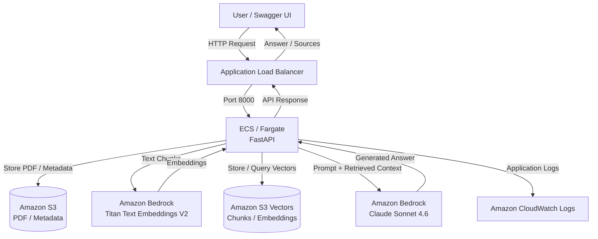
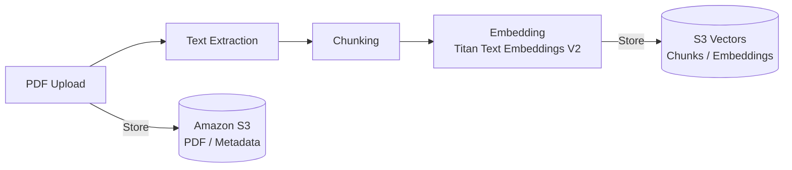
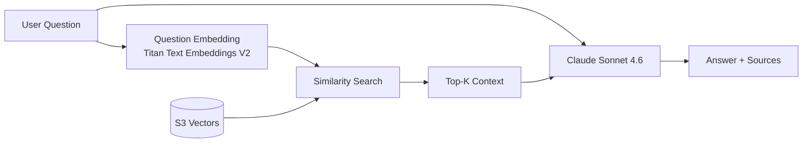

# Document RAG API

PDFドキュメントをアップロードし、その内容に基づいて質問応答を行うRAG（Retrieval-Augmented Generation）APIです。

FastAPIをベースに、Amazon Bedrock、Amazon S3、Amazon S3 Vectorsを組み合わせてRAGを実装し、DockerコンテナとしてAmazon ECS / Fargateへデプロイしています。

ドキュメント・メタデータ・ベクトルをECSタスク外へ永続化することで、タスクの再起動・再デプロイ後も利用できるステートレスな構成としています。

## Features

- PDFのアップロード・テキスト抽出・チャンク分割
- Amazon Titan Text Embeddings V2によるEmbedding生成
- Amazon S3 Vectorsを利用した類似検索
- Claude Sonnet 4.6によるRAG回答生成
- 登録済みドキュメントの一覧取得・削除
- Amazon S3 / S3 Vectorsによるデータ永続化
- Pydanticによる入力値バリデーション
- AWSサービス障害時の例外処理・CloudWatch Logsへのログ出力
- pytestによる自動テスト（19 tests）
- ECS Task RoleによるAWSリソースへの最小権限アクセス

## Architecture



## RAG Processing Flow

### Document Registration



### Question Answering



## Technology Stack

| Category | Technology |
|---|---|
| Language | Python 3.13 |
| API | FastAPI / Pydantic |
| Package Management | uv |
| LLM | Amazon Bedrock / Claude Sonnet 4.6 |
| Embedding | Amazon Titan Text Embeddings V2 |
| Vector Store | Amazon S3 Vectors |
| Object Storage | Amazon S3 |
| Container | Docker |
| Compute | Amazon ECS / AWS Fargate |
| Load Balancer | Application Load Balancer |
| Logging | Amazon CloudWatch Logs |
| Testing | pytest |

## API

| Method | Endpoint | Description |
|---|---|---|
| `POST` | `/documents` | PDFを登録 |
| `GET` | `/documents` | 登録済みドキュメント一覧を取得 |
| `DELETE` | `/documents/{document_id}` | ドキュメントとベクトルを削除 |
| `POST` | `/chat` | 指定したドキュメントに対してRAG質問応答 |
| `GET` | `/health` | ヘルスチェック |

詳細なAPI仕様はFastAPIが生成するSwagger UI（`/docs`）から確認できます。

## Local Development

依存関係をインストールします。

```bash
uv sync
```

開発サーバーを起動します。

```bash
uv run fastapi dev app/main.py
```

Swagger UI:

```text
http://127.0.0.1:8000/docs
```

テストを実行します。

```bash
uv run pytest -v
```

Dockerイメージをビルドします。

```bash
docker build --platform linux/arm64 -t document-rag-api .
```

## Security

- Amazon S3のBlock Public Accessを有効化
- Amazon S3 / S3 VectorsをSSE-S3で暗号化
- ECS Task Roleを利用し、AWSサービスへのアクセスを必要なAction / Resourceへ限定
- ECSへのインバウンド通信をALB Security Groupからのみに制限
- `.env` やAWS認証情報をGit管理対象から除外
- API利用者には内部例外を公開せず、詳細なエラーはCloudWatch Logsへ記録

## Future Work

- Textractを利用したスキャンPDF / 画像PDFへの対応
- RAG検索精度の評価・改善
- RerankingなどRetrieval処理の高度化
- AI Agent機能の追加
- MCP連携
- HTTPS化・Private Subnet化など、本番運用を想定したインフラ強化